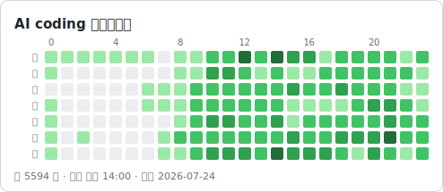
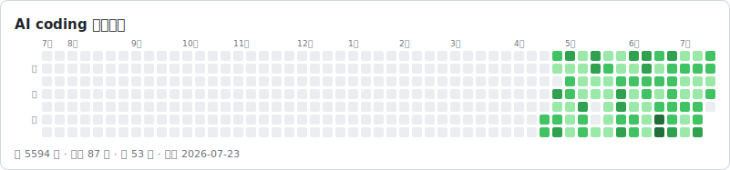
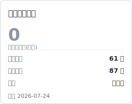
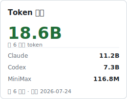
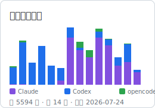
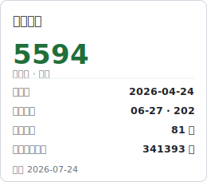
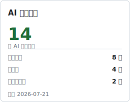
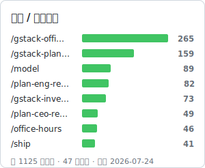

# 我的 AI coding 面板

> 由 [ai2nao](https://github.com/xunull/ai2nao) 从本地数据生成 · 更新于 2026-07-24

## AI coding 作息热力图

周几 × 小时,看几点、周几最常找 AI。

## AI coding 活动日历

GitHub 贡献图式:哪些天在用 AI、连不连续。

<table>
<tr>
<td width="50%" valign="top">
<h3>连续活跃天数</h3>
Duolingo 式连续天数:当前 / 最长 / 累计。  

</td>
<td width="50%" valign="top">
<h3>Token 用量</h3>
近 6 个月 token 总量(各源分布;可选成本)。  

</td>
</tr>
</table>

<table>
<tr>
<td width="50%" valign="top">
<h3>三源使用趋势</h3>
按周统计 Claude / Codex / opencode 的对话量迁移。  

</td>
<td width="50%" valign="top">
<h3>个人纪录</h3>
最忙一天、单时峰值、累计消息、最长一次输入。  

</td>
</tr>
</table>

<table>
<tr>
<td width="50%" valign="top">
<h3>AI 工具清单</h3>
本机在用的 AI 工具数(按类型分)。  

</td>
<td width="50%" valign="top">
<h3>命令 / 技能排行</h3>
最常用的斜杠命令 / 技能 Top 8。  

</td>
</tr>
</table>
